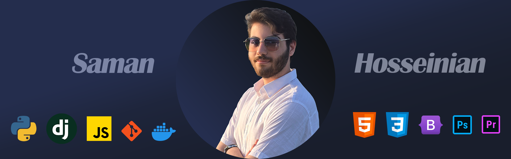

  

<h2 align="center">Hi there 👋</h2>

  I'm <b>Saman</b> 
  💻 Backend Developer passionate about building scalable and reliable applications. 
  🐍 Mainly working with <b>Python</b> & <b>Django</b>. 
  ⚡ Enthusiastic about clean code, open-source, and continuous learning. 

---

<h3 align="center">🛠️ Skills & Tools</h3>

  

---

<h3 align="center">🚀 Featured Projects</h3>

  🔹 <a href="https://github.com/Samanh2005/Project1">Project 1</a> – short description  
  🔹 <a href="https://github.com/Samanh2005/Project2">Project 2</a> – short description

---

<h3 align="center">📊 GitHub Stats</h3>

  
  

---

<h3 align="center">📫 How to reach me</h3>

  
  
  

---

✨ Always curious, always coding. ✨

